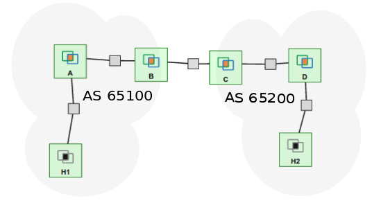

## Understanding Interior and Exterior Peering in BGP

I am trying to gain an in depth understanding of BGP and its working. So I came across this
book, "Practical BGP" written by White, Ross. Rather than just
reading the book and trying to understand, I thought lets try and understand the concepts
by doing configurations on real machines on the GENI testbed and then observing the
behavior.

In this first blogpost I develop an experiment to **verify interior and exterior peering in BGP**.
I am using the topology as given in Fig 1.6 of Chapter 1 with a *slight modification*. I add a
machine named Host1 to router A and machine named Host2 to router D. We will use tools like
ping and traceroute on host1 and host2.

<figure>
  <center>

  </center>
</figure>

Please refer [bgp-peering](https://github.com/ajinkyakadam/NwExperiments/tree/master/bgp-peering)
directory in my github profile for all the configuration files, python scripts and images
that I have used here.

To reserve the same topology on geni use [this rspec](https://raw.githubusercontent.com/ajinkyakadam/NwExperiments/master/bgp-peering/bgp_peering_request_rspec.xml)
You can download it using `curl` or `wget` and then specifying the file as input to `jacks portal`.

This is how our GENI topology looks like.

<figure>
  <center>  
        
  </center>
</figure>

On each router A, B, C, D run the following commands

```
wget https://raw.githubusercontent.com/ajinkyakadam/NwExperiments/master/bgp-peering/install.sh
```

Then run,

```
bash install.sh
```

Now we will turn on zebra and bgpd daemons. First run,

```
cd /etc/quagga/
sudo wget -N https://raw.githubusercontent.com/ajinkyakadam/NwExperiments/master/bgp-peering/daemons
sudo wget -N https://raw.githubusercontent.com/ajinkyakadam/NwExperiments/master/bgp-peering/debian.conf
cd
```

Now we will restart the daemon, by running

```
sudo /etc/init.d/quagga restart
```

You will get the following output at your terminal

```
Stopping Quagga monitor daemon: (watchquagga).
Stopping Quagga daemons (prio:0): (bgpd) (zebra) (ripd) (ripngd) (ospfd) (ospf6d) (isisd) (babeld).
Removing all routes made by zebra.
Loading capability module if not yet done.
Starting Quagga daemons (prio:10): zebra bgpd.
Starting Quagga monitor daemon: watchquagga.
```

Let's add the telnet password for the two daemons zebra and bgpd, on all four routers.
For instance on routerA you will
open the files `/etc/quagga/zebra.conf` and `/etc/quagga/bgpd.conf` and add the
following line

```
password routerA
```
On routerB the password will be `routerB`, for routerC it is `routerC` and for
routerD it is `routerD`. Please change accordingly. Else your python scrpits
would fail to configure the routers properly as I have not handled exception
for giving the wrong password as input.

Save the files and restart quagga by running,

```
sudo /etc/init.d/quagga restart
```

Now copy the `routerA.py` file to router A using scp as follows

```
scp routerA.py geni-username@hostname:~/
```

Replace geni-username with your username and hostname with the machines named
which can be found from the portal.  Below is a screen shot from the slice details page of my slice.  


In this case to copy the configuration scripts to routerA you will issue the following two commands.

```
scp -P 34618 routerA.py adk427@pc1.pks2.sdn.uky.edu:~/

scp -P 34618 routerAbgpprocess.py adk427@pc1.pks2.sdn.uky.edu:~/
```

Similarly copy all the remaining files to the respective routers. Once you are done copying the scripts, we will login in to each machine. For instance to login to routerA run

```
ssh adk427@pc1.pks2.sdn.uky.edu -p 34618
```

Then execute both scripts, on each machine. For example on routerA you would run

```
python routerA.py
python routerAbgpprocess.py
```

Similarly on routerB, routerC, and routerD. Then we login in to host1 by running

```
ssh adk427@pc2.pks2.sdn.uky.edu -p 32062
```

we will ping host2 and also do a traceroute to host2 IP.

First let's do ping by running

```
ping 10.1.5.1
```

We confirm from the below output that we are successfully able to ping host2
which is present in AS65200.

<figure>
  <center>  
        
  </center>
</figure>


Now we will do a `traceroute` to `Host2` by running

```
traceroute 10.1.5.1
```

From the below capture we see what intermediate routers are present between
host 1 and host 2. So from the capture below that we have the path as


Host 1 --> Router A --> Router B --> Router C --> Router D --> Host 2


<figure>
  <center>  
        
  </center>
</figure>


We will also do a `show ip bgp` on each router to observe what type of peering they
form. To do this run

```
telnet localhost 2604
```

then provide the passwords for each router accordingly. For instance password for
router A is `routerA` for both modes.

In privilged mode run

```
show ip bgp
```

We get the following output. From the below image we observe that networks between
router B and router C (10.1.3.0), router C and router D (10.1.4.0), and router D
and host 2 (10.1.5.0) are all learned from the iBGP peer router B. Next we observe
router B table.

<figure>
  <center>  
        
  </center>
</figure>


Here is router B table,

<figure>
  <center>  
        
  </center>
</figure>


From the above figure we observe that the network between router A and Host 1,
is learnt from an IGP protocol. Here the peering between router A and router B is
formed via iBGP. Hence router A distributes its routes to its iBGP peer router B.

We also see that we learn about networks 10.1.4.0 and 10.1.5.0 from router C (10.1.3.2)
interface connected to router B, here router C acts as our eBGP peer and these networks
are not learnt via IGP

The network 10.1.3.0 occurs with next-hop as 10.1.3.2 because our exterior neighbor router C
advertises that. Similarly on router C we will observe that same network since router B
also advertises this network with next hop as router B.

Lets see router C bgp table.

<figure>
  <center>  
        
  </center>
</figure>

Here we observe that we learn networks 10.1.4.0 and 10.1.5.0 from IGP, which are
annonunced by our iBGP peer router D. Network 10.1.1.0 is learnt via our eBGP peer
router B.

Lets see the bgp table for router D

<figure>
  <center>  
        
  </center>
</figure>

We learn two networks 10.1.1.0 and 10.1.3.0 from our iBGP peer router C. While
the rest two networks 10.1.4.0 and 10.1.5.0 are advertised by router D, hence
router D itself is the best path to go to those networks.


It was fun doing this experiment!!!

