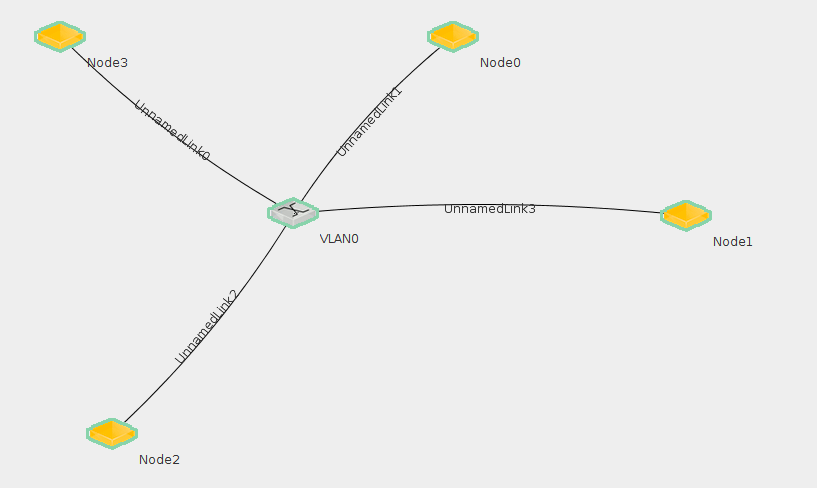
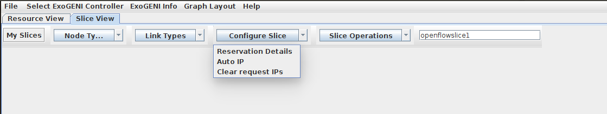
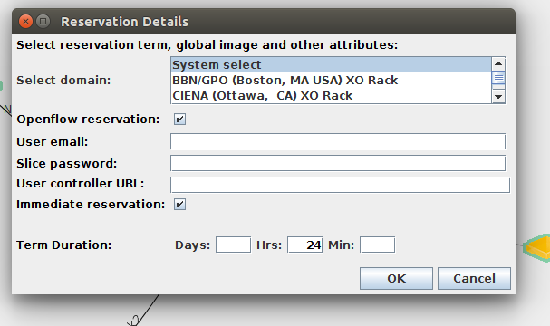
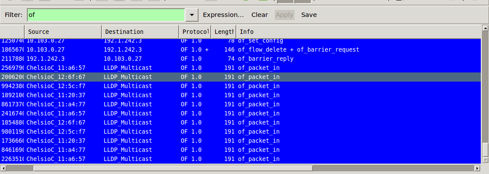

### Steps to create openFlow Topology on ExoGeni

The below experiment is not yet complete as I am facing some error which I have described below. 
I hope to resolve it by today. 

Prerequisites :
* Geni Account 
* Must have the downloaded the geni keys 

First lets install latest java update, since we are going to use [Flukes](https://geni-orca.renci.org/trac/wiki/flukes#OpenFlow) tool which requires the java version to be upto date. On your terminal run 

```
sudo add-apt-repository ppa:webupd8team/java
sudo apt-get update
sudo apt-get install oracle-java8-installer
```

Then lets download flukes by running 
```
curl http://geni-images.renci.org/webstart/flukes.jnlp > ~/Downloads/flukes.jnlp
```

Start flukes using 
```
javaws flukes.jnlp
```

Once flukes is started go to help, then `Preference Settings` copy the complete text inside that box. Open a file called `.flukes.properties` in your home folder. Paste the text in that file and save the file. 

Now, check where your xterm is located by running 
``
which xterm
``

Take a note of that path and compare the path of the variable `xterm.path` in your `.flukes.properties` file. If the path is same no worries, if not then replace the path by the output of the `which xterm` command. 

lets reserve some resources. We will create a topology consisting of 4 nodes and a switch. To create a node 
on flukes go to slice view and then under `Node Type` select `Node`. You can now create 4 nodes by clicking on the canvas below. 

Once the nodes are created, right click on each node and go to `edit properties` tab where you will have to select 

* Image : Ubuntu 14.04
* NodeType : XO Medium

and also the rack where you want to get resource from. 

Create a switch by selecting `broadcast link` under `Node Type`. Now create a link by clicking on the node and then dragging your mouse to connect to the `VLAN 0` node which is your switch. Connect all node in the below fashion 



Then under configure slice tab, do `Auto IP` so that you don't need to configure IP address for each node 



Next we will reserve the slice as an openFlow reservation, by going to `configure slice` and then `Reservation Details`



Please add your email, controller IP which should be in the below format 

```
tcp:hostname:6633
```

hostname is any publicly routable node IP address

For instance in our case it is 

```
tcp:152.54.14.47:6633
```

The password string can be anything, it doesn't matter. 

Start the openFlow controller on your controller node and use wireshark to visualize packet flows. 


### Error : Unable to see Flow Modification messages

I have created the above topology and I am using POX as my controller. I am using the example script of_tutorial which I 
modified to create a learning switch and also add a flow entry if the destination mac is present in the mac-table. 

However when I  run the controller and ping from node0 to node 2 and observer the wireshark output I am not getting any 
flow addition packets neither a packet_in for the ping messages. What I am looking at is only LLDP multicast packets. 
I am not sure why I observe LLDP multicast packets only!! Please have a look at the below wireshark capture 



What am I missing ? 


### Update :


Please refer the disucssion [here](https://groups.google.com/forum/#!searchin/geni-orca-users/Ajinkya%7Csort:relevance/geni-orca-users/XVZfbvXtPEg/MTOXcJqeEAAJ)

I would be using a regular node and turning it into a software switch by loading the OVS image. I will then check if the logic works as expected and then move onto suggestion given by llya. 
> you need to probably read up on the OpenFlow implementation for the BNT 8264. You also may want to bind your request specifically to e.g. RCI rack. 


