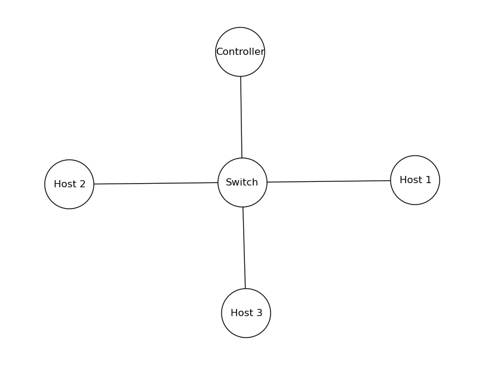
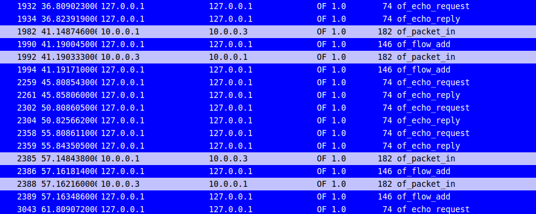

### Implementing a Learning Switch and Adding a Flow Entry if destination MAC is known using POX

In order to start with the basics, I am using this 
[tutorial](https://github.com/mininet/openflow-tutorial/wiki/Create-a-Learning-Switch) as it is a great starting point. 
Basic hub like functionality is provided in `pox/misc/of_tutorial.py` file where the switch forwards any packet it receives 
to all the ports except on which it received the packet. To build on it we need to create a learning switch which learns the port number from the source mac address, so if for future reference there is packet containting the destination mac address 
which is previously learnt and added to the mac-table then we just forward the packet to the corresponding output port. 


Here is the topology, which we create using mininet. 



To create above topology use 
```
 sudo mn --topo single,3 --mac --switch ovsk --controller remote
```
Now lets add the port learning behavior. We add the following code to the method `act_like_switch`

```
# Get the source and destination MAC, and also the input port 
# for a given packet
	
src_mac_addr = str(packet.src)
dst_mac_addr = str(packet.dst)
input_port = packet_in.in_port
       
## Add the source MAC to the correpsonding input port 

if src_mac_addr not in self.mac_to_port:
	 self.mac_to_port[src_mac_addr] = input_port
```
What the above code does is that it stores the input port to source mac address like a key value pair in a dictionary named `mac_to_port`. 

Next, we add a flow entry to the switch if a packet with known source and destination arrives. Following code is added to `act_like_switch` method to turn the switch into a flow based switch. 
```
 if dst_mac_addr in self.mac_to_port:
     out_port = self.mac_to_port[dst_mac_addr]	
     msg = of.ofp_flow_mod()
     msg.match = of.ofp_match.from_packet(packet)
     msg.idle_timeout = 10
     msg.hard_timeout = 15
     msg.buffer_id = packet_in.buffer_id
     action = of.ofp_action_output(port = out_port)
     msg.actions.append(action)
     self.connection.send(msg) 
```

The above code checks if the destination address is present in the mac table, and if there is an entry ..BINGO!! a flow entry is added to the switch. The flow entry tells the switch to forward all the further packets from the output port which is the port corresponding to the destination mac address. We also set `idle_timeout, hard_timeout, buffer_id` parameters. These parameters affect the duration till which to store the flow entry and tells the switch to remove it after a certain interval. These paramters are clearly defined in the [tutorial](https://github.com/mininet/openflow-tutorial/wiki/Create-a-Learning-Switch).

> idle_timeout - Number of idle seconds before the flow entry is removed. Defaults to no idle timeout.

> hard_timeout - Number of seconds before the flow entry is removed. Defaults to no timeout.

> actions - A list of actions to perform on matching packets (e.g., ofp_action_output)

> buffer_id - The buffer_id of a buffer to apply the actions to immediately. Leave unspecified for none.

We verify whether our code does the flow modification behavior and the attributes we set like idle_timeout, hard_timeout are actually working. We use wireshark to capture the openflow packets. 

Lets first run the openflow controller from the pox directory, 
```
./pox.py log.level --DEBUG misc.of_tutorial
```

We have already created the topology so we will use the `xterm` terminal to get a command line interface for each of the three hosts. Run on the mininet console 
```
xterm h1 h2 h3
```
To check whether if there are any flow entries in the switch run 
```
sh ovs-ofctl dump-flows s1
```
You will observe 
```
mininet> sh ovs-ofctl dump-flows s1
NXST_FLOW reply (xid=0x4):
mininet>
```
which means as of now there are no flow entries in the flow table of s1 switch. 

We will ping h3 from h1 and observe the wireshark output. From h1 xterm type 
```
ping 10.0.0.3
```

The following output illustrates that the switch adds a flow entry when it sees incoming packet from h1 and h3 to send packet out to port 3 and 1 respectively. That is packet coming from h1 must go out of port 3 and from h3 out of port 1. We verify this by looking at the flow tables at switch s1 by running 

`sh ovs-ofctl dump-flows s1`

on the mininet console. We observe the following 

```
mininet> sh ovs-ofctl dump-flows s1
NXST_FLOW reply (xid=0x4):
cookie=0x0, duration=2.479s, table=0, n_packets=3, n_bytes=294, idle_timeout=10, hard_timeout=15, idle_age=0, icmp,vlan_tci=0x0000,dl_src=00:00:00:00:00:01,dl_dst=00:00:00:00:00:03,nw_src=10.0.0.1,nw_dst=10.0.0.3,nw_tos=0,icmp_type=8,icmp_code=0 actions=output:3
cookie=0x0, duration=2.477s, table=0, n_packets=3, n_bytes=294, idle_timeout=10, hard_timeout=15, idle_age=0, icmp,vlan_tci=0x0000,dl_src=00:00:00:00:00:03,dl_dst=00:00:00:00:00:01,nw_src=10.0.0.3,nw_dst=10.0.0.1,nw_tos=0,icmp_type=0,icmp_code=0 actions=output:1
```
It clearly verifies that the switch added flow entries to the table. From the wireshark output below we can also verify that whether the flow entries are really deleted. Since we are continously pining h3 the idle_timeout won't be in effect however the hard_timeout will delete the flow entry no matter what. Lets confirm this from the below capture output 



From the image above we see that two flow entries that were added at 41s are readded at 57 seconds that means these were deleted in 15s which is our `hard_timeout` timer. Great this completes our first experiment with POX controller and mininet. 
