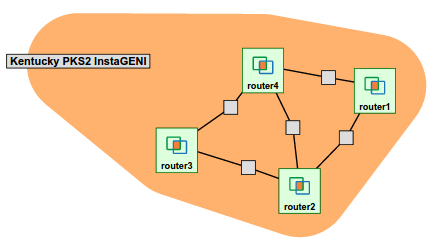
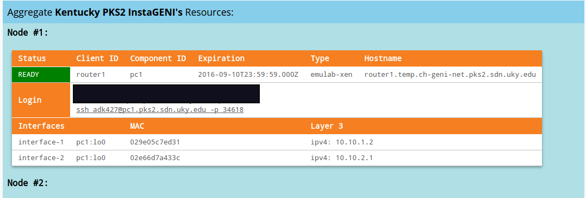

## Instructions to use the scripts 
Scripts included in this directory are developed to automatically configure the below topology. Here we emulate the 4 nodes 
as routers running OSPF protocol. The nodes were reserved using the geni research testbed. You need a geni account to log in to the [portal](https://portal.geni.net/). Also you will need to have downloaded the keys from portal and placed them in your `~/.ssh/` directory. The below machines all have been booted with Ubuntu 12.04LTS



### Pre Requisite : 
If you are using GENI machines then you can slice details page to get the login command. 
For instance, to login to a machine you will run the following on your terminal. (Note you will replace geni-username by your actual username.)
```
ssh geni-username@pc1.pks2.sdn.uky.edu -p 34618
```


#### Install pexpect module in python.
I am using the pip package manager which I have 
installed on all 4 machines. by running 
```
sudo apt-get update
sudo apt-get install -y python-pip
```


To install pexpect module run 
```
sudo pip install pexpect
```
#### Set up Quagga.
Please follow the below instructions on each machine. 

On each machines terminal run 

    sudo apt-get install quagga 

Now lets enable IPv4 forwarding as we need IPV4 support only for OSPFv2 

    echo "net.ipv4.conf.all.forwarding=1" | sudo tee -a /etc/sysctl.conf 
    echo "net.ipv4.conf.default.forwarding=1" | sudo tee -a /etc/sysctl.conf

Then do, 

    sudo sysctl -p 

Lets create the configuration files. You may use a different editor to create those files like vim, gedit.  

    sudo nano /etc/quagga/ospfd.conf 
    sudo nano /etc/quagga/vtysh.conf 
    sudo nano /etc/quagga/zebra.conf 
    
Now lets change the permission of those configuration files 
    
    sudo chown quagga:quaggavty /etc/quagga/vtysh.conf && sudo chmod 660 /etc/quagga/vtysh.conf 
    sudo chown quagga:quagga /etc/quagga/zebra.conf && sudo chmod 640 /etc/quagga/zebra.conf 
    sudo chown quagga:quagga /etc/quagga/ospfd.conf && sudo chmod 640 /etc/quagga/ospfd.conf

By default all routing protocols are disabled in the file /etc/quagga/daemons, so we will need to enable those daemons that we need for this experiment. 

    sudo vim /etc/quagga/daemons

and then replace 

    zebra=no
    ospfd=no
with 

    zebra=yes
    ospfd=yes
    
Now we will edit file `/etc/quagga/debian.conf` by replacing 

    zebra_options=" --daemon -A 127.0.0.1"
    ospfd_options=" --daemon -A 127.0.0.1"

with

    zebra_options=" --daemon -A 127.0.0.1 -P 2601 -u quagga -g quagga"
    ospfd_options=" --daemon -A 127.0.0.1 -P 2604 -u quagga -g quagga"

Now we will restart the daemon, by running

    sudo /etc/init.d/quagga restart 

You will get the following output at your terminal 

    Stopping Quagga daemons (prio:0): (ospfd) (zebra) (bgpd) (ripd) (ripngd) (ospf6d) (isisd).
    Removing all routes made by zebra.
    Loading capability module if not yet done.
    Starting Quagga daemons (prio:10): zebra ospfd.

From the above output you may confirm that we have started the zebra daemon and ospfd daemon successfully. 

We need to add telnet password to the zebra and ospfd daemon else we won't be able to log in to those processes. 
On each router open the zebra.conf and ospfd.conf using any of your favorite text editors and paste the below line 
in case of router1. For router2 it will be `password router2` and so on. (Note the files are located in /etc/quagga/ so you will need root permissions to edit those files. )
```
password router1
```

### Router OSPF configuration 
You will then copy the configuration files in this directory to each of the respective nodes. 
For example, you will copy `router1.py` and `router1ospfprocess.py` to router1 node. The copy operation can be 
achieved easily using `scp`. Below is an example 
```
scp -P PORT_NUMBER filename username@hostname:~/
```
If you are using GENI testbed then you can get the hostname from slice details. Below is a screen shot from the slice details page of my slice.  


In this case to copy the configuration scripts to router1 you will issue the following two commands. 
```
scp -P 34618 router1.py adk427@pc1.pks2.sdn.uky.edu:~/
scp -P 34618 router1ospfprocess.py adk427@pc1.pks2.sdn.uky.edu:~/
```

Similarly copy all the remaining files to the respective routers. Once you are done copying the scripts, we will login in to each machine. For instance to login to router1 run 
```
ssh adk427@pc1.pks2.sdn.uky.edu -p 34618
```
Then execute both scripts, on each machine. For example on router1 you would run

```
python router1.py
python router1ospfprocess.py
```

Thats it!!!. You have a 4 router topology running OSPF routing protocol. You can now telnet to the OSPF process on each router using 
```
telnet localhost 2604
```


